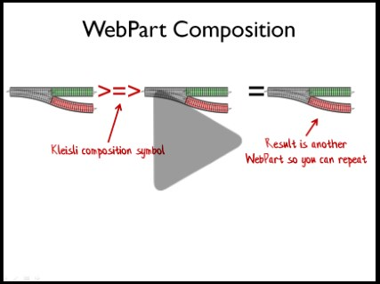

This page contains links to the slides and code from my talk "The Power of Composition". 

Here's the blurb for the talk:

> Composition is a fundamental principle of functional programming, but how is it different from an object-oriented approach, and how do you use it in practice? 
>   
> In this talk for beginners, we'll start by going over the basic concepts of functional programming, and then look at some different ways that composition can be used to build large things from small things. 
>   
> After that, we'll see how composition is used in practice, beginning with a simple FizzBuzz example, and ending with a complete (object-free!) web application.

## Videos

Video from NDC London, Jan 17, 2018 (Click image to view video) 

## Slides 

Slides from NDC London, Jan 17, 2018

<iframe src="//www.slideshare.net/slideshow/embed_code/key/A278crThk3kCUU" width="425" height="355" frameborder="0" marginwidth="0" marginheight="0" scrolling="no" style="border:1px solid #CCC; border-width:1px 1px 0; margin-bottom:5px; max-width: 100%;" allowfullscreen> </iframe> 

 
<strong><a href="https://www.slideshare.net/ScottWlaschin/the-power-of-composition" title="The Power of Composition" target="_blank">The Power of Composition</a> </strong> from <strong><a href="http://www.slideshare.net/ScottWlaschin" target="_blank">my slides on Slideshare</a></strong> 

