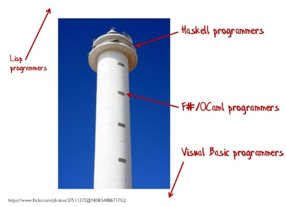

This page contains links to the slides and code from my talk "Functional Programming Design Patterns". 
**Over [100,000 views on YouTube](https://www.youtube.com/watch?v=E8I19uA-wGY)!**

Here's the blurb:

> In object-oriented development, we are all familiar with design patterns
> such as the Strategy pattern and Decorator pattern, and design principles such as SOLID. 
>   
> The functional programming community has design patterns and principles as well. 
>   
> This talk will provide an overview of some of these, and present some 
> demonstrations of FP design in practice.

## Videos
 
Below is the video recorded at NDC London 2014 (click image to view video). It's an hour long and I whiz through as fast as I can!

I did the same talk at the London F# Meetup in January, 2015. This time, there were questions during the talk, and I went a bit slower. As a result, it's about two hours long!

## Slides 

Here are the slides that I used at NDC London 2014:
 
<iframe src="//www.slideshare.net/slideshow/embed_code/42373281" width="427" height="356" frameborder="0" marginwidth="0" marginheight="0" scrolling="no" style="border:1px solid #CCC; border-width:1px 1px 0; margin-bottom:5px; max-width: 100%;" allowfullscreen> </iframe> 

There's also a [longer version of the slides](http://www.slideshare.net/ScottWlaschin/fp-patterns-ndc-london2014) as well.

## Twitterstorm!

After I did this talk at BuildStuff 2014, one particular slide got retweeted a lot.

<blockquote class="twitter-tweet" lang="en">
I love this slide from <a href="https://twitter.com/ScottWlaschin">@ScottWlaschin</a> &#39;s talk on FP &quot;patterns&quot; <a href="http://t.co/8UuwVqlelD">pic.twitter.com/8UuwVqlelD</a>
&mdash; Knot, Not Naught! (@jeroldhaas) <a href="https://twitter.com/jeroldhaas/status/535919819355598848">November 21, 2014</a></blockquote>

Alas, it got misinterpreted by both the pro-FP and anti-FP people!
 
<blockquote class="twitter-tweet" lang="en">
<a href="https://twitter.com/abt_programming">@abt_programming</a> this slide is an open-and-shut case of FP bigotry. <a href="https://twitter.com/ScottWlaschin">@scottwlaschin</a> <a href="https://twitter.com/jeroldhaas">@jeroldhaas</a> <a href="https://twitter.com/sgoguen">@sgoguen</a>
&mdash; Yehuda Katz (@wycats) <a href="https://twitter.com/wycats/status/536737859466588161">November 24, 2014</a></blockquote>

Even Uncle Bob [wrote a post about it](http://blog.cleancoder.com/uncle-bob/2014/11/24/FPvsOO.html)!

Oh dear! Humor doesn't work out of context. So in the NDC and Skills Matter version of the talk I decided to make it clearer that I was making fun of FP people who live in an ivory tower: 

 

Hope you enjoy the talk!