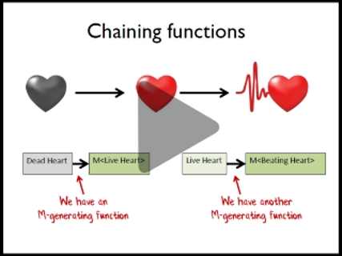

This page contains links to the slides and video from my talk "Dr Frankenfunctor and the Monadster". 

*WARNING: This talk contains:*

* *gruesome topics*
* *strained analogies*
* *discussion of monads*

Here's the blurb for the talk:

> You've got a pile of assorted functions lying around. Each one is useful and reliable, but they just don't fit together properly. 
> How can you assemble them into a complete system that can stand on its own two feet and terrorize the local villagers?
>   
> In this session, I'll show how functional programming can transform all sorts of existing code into shapes that are plug-compatible and which can be bolted together effortlessly.
>   
> SAFETY NOTE: The techniques demonstrated are perfectly harmless and can even be used at your workplace -- no lightning bolts required.

## Video

Video from *NDC London 2016*, Jan 14, 2016 (Click image to view video) 

## Slides 

Slides from *Leetspeak 2015*, Stockholm, Oct 10, 2015

<iframe src="//www.slideshare.net/slideshow/embed_code/key/4oCVwCraxCrAfx" width="425" height="355" frameborder="0" marginwidth="0" marginheight="0" scrolling="no" style="border:1px solid #CCC; border-width:1px 1px 0; margin-bottom:5px; max-width: 100%;" allowfullscreen> </iframe> 

 
<strong><a href="https://www.slideshare.net/ScottWlaschin/dr-frankenfunctor-and-the-monadster" title="Dr Frankenfunctor and the Monadster" target="_blank">Dr Frankenfunctor and the Monadster</a> </strong> from <strong><a href="http://www.slideshare.net/ScottWlaschin" target="_blank">my slides on Slideshare</a></strong> 

## Related posts

This talk inspired a series of blog posts on this same topic:

* [Dr Frankenfunctor and the Monadster](/posts/monadster/)
* [Completing the body of the Monadster](/posts/monadster-2/)
* [Refactoring the Monadster](/posts/monadster-3/)

Also related are the posts on map and bind, and on two-track error handling:

* [Map and Bind and Apply, Oh my!](/series/map-and-bind-and-apply-oh-my.html)
* [A functional approach to error handling ("Railway Oriented Programming")](/rop/)

## Background

In the summer of 2015, the team organizing [Leetspeak](http://leetspeak.se/) asked me to present a talk on the theme of "It's Alive".

I was feeling uninspired, so of course I grasped at the most obvious and unimaginative metaphor possible -- the story of Frankenstein. And the idea of building
a body from various ill-fitting parts then led naturally to the talk being about function composition, and transforming ill-fitting functions to a consistent shape using `map` and `bind`.

Generally I don't like to make my talks *too* complicated, but the organizers explicitly said that they wanted hard and complex stuff! Ok then!

And they seemed to like it:

<blockquote class="twitter-tweet" data-partner="tweetdeck">
.<a href="https://twitter.com/ScottWlaschin">@ScottWlaschin</a> talk is exactly what we aimed for <a href="https://twitter.com/hashtag/leetspeak?src=hash">#leetspeak</a>. Leaves you mindblown and feeling that there&#39;s stuff you still need to learn.:D
&mdash; Michal Lusiak (@mlusiak) <a href="https://twitter.com/mlusiak/status/652777865952526337">October 10, 2015</a></blockquote>

So, apologies if you find it too intense. I plead diminished responsibility!

