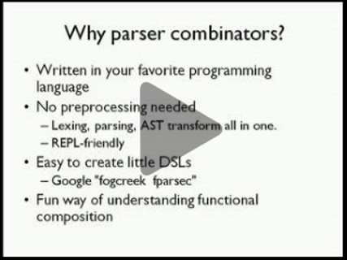

This page contains links to the slides and code from my talk "Understanding parser combinators". 

Here's the blurb for the talk:

> Traditionally, writing parsers has been hard, involving arcane tools like Lex and Yacc.
> An alternative approach is to write a parser in your favourite programming language, 
> using a "parser combinator" library and concepts no more complicated than regular expressions. 
>   
> In this talk, we'll do a deep dive into parser combinators.
> We'll build a parser combinator library from scratch in F# using functional programming techniques, 
> and then use it to implement a full featured JSON parser.

This talk is based on my blog posts on this topic:

* [Understanding parser combinators](/series/understanding-parser-combinators.html)

## Videos

Video from NDC Oslo, Jun 9, 2016 (Click image to view video) 

## Slides 

Slides from NDC Oslo, Jun 9, 2016

<iframe src="//www.slideshare.net/slideshow/embed_code/key/18PTe3gSh1LwF4" width="427" height="356" frameborder="0" marginwidth="0" marginheight="0" scrolling="no" style="border:1px solid #CCC; border-width:1px; margin-bottom:5px; max-width: 100%;" allowfullscreen> </iframe> 

<strong> <a href="//www.slideshare.net/ScottWlaschin/understanding-parser-combinators" title="Understanding parser combinators" target="_blank">Understanding parser combinators</a> </strong> from <strong><a href="http://www.slideshare.net/ScottWlaschin" target="_blank">my slides on Slideshare</a></strong>.

